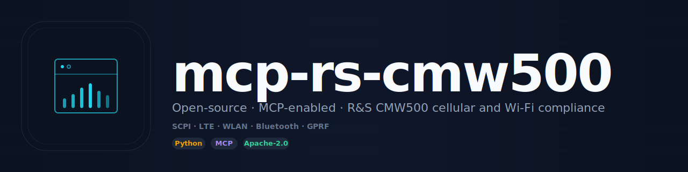

<div align="center">



<br/>

[](https://github.com/RFingAdam/mcp-rs-cmw500/actions/workflows/ci.yml)
[](LICENSE)
[](https://www.python.org/downloads/)
[](https://modelcontextprotocol.io)
[](https://github.com/RFingAdam/eng-mcp-suite)

**Drive the Rohde & Schwarz CMW500 Wideband Radio Communication Tester from any MCP-compatible AI client.**
**Direct TCP/IP SCPI (port 5025) — 79 tools across LTE signaling, WLAN, Bluetooth/BLE, and GPRF. No CMWrun dependency.**

[Quick start](#quick-start) ·
[Tools](#tools) ·
[Workflows](#workflows) ·
[Documentation](#documentation)

</div>

---

> [!IMPORTANT]
> **Hardware required.** This MCP server controls a real R&S **CMW500**
> Wideband Radio Communication Tester over TCP/IP SCPI. You need an
> actual CMW500 on the network to be useful. The server is a thin
> driver — no built-in simulator. The relevant CMW500 application
> licenses (LTE / WLAN / Bluetooth / GPRF) must be enabled on the unit
> for the matching tool surface to do anything.

## What is mcp-rs-cmw500?

`mcp-rs-cmw500` is a [Model Context Protocol](https://modelcontextprotocol.io)
server that automates the **R&S CMW500 Wideband Radio Communication Tester**
over direct TCP/IP SCPI (port `5025`). No CMWrun dependency, no proprietary
middleware — your AI agent talks to the CMW500 the same way a Python script
would, only in natural language.

The server covers five RF technology domains: LTE signaling (cell config,
NAS/bearer, C-DRX, full TX measurements), WLAN non-signaling
(802.11a/b/g/n/ac/ax with 20/40/80/160 MHz channels), Bluetooth/BLE
non-signaling (Classic DH1-DH5 + LE 1M/2M/Coded), GPRF generator/analyzer
(CW/ARB output, power/spectrum measurements), and shared signal-path control.

**What `mcp-rs-cmw500` does well:**

- 🤖 **AI-native via MCP.** First-class [Model Context Protocol](https://modelcontextprotocol.io)
  server with 79 tools across 5 RF technology domains. Any Claude / LLM agent
  can drive it.
- 🐍 **Python + MCP surfaces.** Import `rs_cmw500_mcp` for direct driver access,
  or run as an MCP server for AI-agent automation.
- ⚡ **Direct SCPI.** TCP/IP straight to the CMW500 — no CMWrun, no NI-VISA
  install, no vendor middleware.
- ✅ **Pre-built templates.** `lte_tx_power`, `gprf_power`, `nonsig_rx`,
  `wlan_tx`, `wlan_rx`, `ble_tx`, `ble_rx`, `bt_classic_tx`.
- 🔒 **AGPL-3.0-or-later.** Safety system (power / frequency clamps),
  SCPI-injection-guarded, raw-SCPI disable flag.

---

## Quick start

### Install

```bash
git clone https://github.com/RFingAdam/mcp-rs-cmw500.git
cd mcp-rs-cmw500
uv pip install -e ".[dev]"
```

### Configure

```bash
cp .env.example .env   # edit with your CMW500 IP + safety limits
```

| Variable | Default | Description |
| -------- | ------- | ----------- |
| `CMW_DEFAULT_HOST` | `127.0.0.1` | CMW500 IP address |
| `CMW_DEFAULT_PORT` | `5025` | SCPI TCP port |
| `CMW_MAX_GENERATOR_POWER_DBM` | `0` | Max generator output |
| `CMW_MAX_EXPECTED_POWER_DBM` | `33` | Max analyzer input |
| `CMW_MAX_FREQUENCY_HZ` | `6e9` | Upper frequency bound |
| `CMW_ALLOW_RAW_SCPI` | `false` | Enable raw SCPI commands |

### Two surfaces, same answer

<table>
<tr>
<td valign="top" width="50%">

**Python**

```python
import asyncio
from rs_cmw500_mcp.driver import CMW500Driver

async def main():
    async with CMW500Driver("192.168.1.100", 5025) as cmw:
        await cmw.lte_configure_cell(
            band=7, bandwidth_mhz=20, earfcn=3100, dl_power_dbm=-70,
        )
        await cmw.lte_cell_on()
        # ... wait for UE attach ...
        await cmw.lte_meas_configure(stat_count=10)
        await cmw.lte_meas_trigger()
        results = await cmw.lte_meas_fetch_all()
        print(results)

asyncio.run(main())
```

</td>
<td valign="top" width="50%">

**MCP (Claude Desktop, Claude Code, any MCP client)**

```json
{
  "mcpServers": {
    "rs-cmw500": {
      "command": "uv",
      "args": [
        "--directory", "/path/to/mcp-rs-cmw500",
        "run", "rs-cmw500-mcp"
      ]
    }
  }
}
```

Then ask your assistant:

> *"Bring up a 20 MHz LTE cell on band 7 EARFCN 3100, wait for the UE to attach, then trigger TX power, EVM, ACLR, SEM, and frequency-error measurements."*

The agent walks the LTE measurement workflow tool-by-tool and returns the
result set.

</td>
</tr>
</table>

### Run

```bash
rs-cmw500-mcp        # MCP server over stdio
```

---

## Tools

79 MCP tools, grouped:

| Group | Count | Examples |
| ----- | ----- | -------- |
| **Connection** | 6 | `cmw_discover`, `cmw_connect`, `cmw_identify`, `cmw_get_status`, `cmw_query_options` |
| **GPRF Generator** | 7 | `cmw_gen_set_frequency`, `cmw_gen_set_level`, `cmw_gen_output_on/off`, `cmw_gen_load_arb`, `cmw_gen_configure_arb` |
| **GPRF Analyzer** | 10 | `cmw_meas_configure_power`, `cmw_meas_configure_spectrum`, `cmw_meas_trigger`, `cmw_meas_fetch_power`, `cmw_meas_fetch_spectrum` |
| **GPRF Signal Path** | 4 | `cmw_set_signal_path`, `cmw_get_signal_path`, `cmw_set_port`, `cmw_system_all_off` |
| **LTE Signaling** | 16 | `cmw_lte_configure_cell`, `cmw_lte_cell_on/off`, `cmw_lte_configure_nas/bearer/cdrx`, `cmw_lte_meas_*` |
| **WLAN Non-Signaling** | 11 | `cmw_wlan_configure`, `cmw_wlan_set_standard/bandwidth/frequency`, `cmw_wlan_fetch_*` |
| **Bluetooth/BLE Non-Signaling** | 11 | `cmw_bt_configure`, `cmw_bt_set_technology/ble_mode/packet_type`, `cmw_bt_fetch_*` |
| **SCPI** | 4 | `cmw_scpi_send`, `cmw_scpi_query`, `cmw_reset`, `cmw_preset` |
| **Templates** | 3 | `cmw_list_templates`, `cmw_load_template`, `cmw_apply_template` |
| **State** | 3 | `cmw_save_state`, `cmw_load_state`, `cmw_get_full_state` |
| **Limits** | 4 | `cmw_define_limit`, `cmw_check_limits`, `cmw_list_limits`, `cmw_clear_limits` |

Available templates: `lte_tx_power`, `gprf_power`, `nonsig_rx`, `wlan_tx`,
`wlan_rx`, `ble_tx`, `ble_rx`, `bt_classic_tx`. Full tool reference in
[`docs/tools.md`](docs/tools.md).

---

## What it solves

| Domain | Measurements | Standards |
| ------ | ------------ | --------- |
| **LTE signaling** | Cell setup, NAS attach, bearer, C-DRX, TX power, EVM, ACLR, SEM, frequency error | 3GPP TS 36.521 |
| **WLAN non-signaling** | 802.11a/b/g/n/ac/ax @ 20/40/80/160 MHz: TX power, EVM, spectrum flatness, frequency error | IEEE 802.11 |
| **Bluetooth Classic** | DH1-DH5 packet types: TX power, modulation (DEVM), frequency offset/drift | Bluetooth Core 5.x |
| **BLE** | 1M / 2M / Coded S2 / S8: TX power, modulation, frequency | Bluetooth Core 5.x |
| **GPRF** | CW/ARB output, power, spectrum — for vendor-specific test sequences | — |

---

## Safety

The server enforces configurable safety limits to protect your equipment:

- **Generator power** — bounded between `CMW_MIN_GENERATOR_POWER_DBM` and
  `CMW_MAX_GENERATOR_POWER_DBM`.
- **Analyzer expected power** — bounded by `CMW_MAX_EXPECTED_POWER_DBM`.
- **Frequency range** — bounded between `CMW_MIN_FREQUENCY_HZ` and
  `CMW_MAX_FREQUENCY_HZ`.
- **SCPI sanitization** — all parameters validated against injection patterns.
- **Raw SCPI off by default** — must explicitly set `CMW_ALLOW_RAW_SCPI=true`.
- **Path traversal** — state-file paths validated against directory traversal.

---

## Workflows

`mcp-rs-cmw500` fits in the following [eng-mcp-suite](https://github.com/RFingAdam/eng-mcp-suite)
workflow bundles:

- **`lab-automation`** — pair with `copper-mountain-vna-mcp`,
  `mcp-rs-spectrum-analyzer`, and `mcp-rs-siggen` for end-to-end RF
  bench-test workflows driven from a single agent session.
- **`cellular-compliance`** — drive 3GPP TS 36.521 LTE test cases under AI
  control with `mcp-emc-regulations` supplying market-specific limits.

```bash
eng-mcp-suite install --workflow lab-automation
```

---

## Documentation

- 📘 **[Quick Start](docs/index.md)** — install through first call.
- 🛠️ **[Tool reference](docs/tools.md)** — every MCP tool, every argument.
- 📐 **[Usage examples](docs/usage.md)** — an LTE TX measurement walkthrough.
- 🏗️ **[Architecture](docs/architecture.md)** — how this MCP fits in eng-mcp-suite.
- 📝 **[Changelog](CHANGELOG.md)**

---

## Part of eng-mcp-suite

<sub>This MCP server is part of</sub>

[](https://github.com/RFingAdam/eng-mcp-suite)

<sub>Part of [eng-mcp-suite](https://github.com/RFingAdam/eng-mcp-suite) — an open
umbrella of MCP servers for RF / EMC / PCB / signal-integrity engineering. Drop
into the `lab-automation` workflow bundle with
`eng-mcp-suite install --workflow lab-automation`.</sub>

| Domain                    | Sibling MCPs                                                                 |
| ------------------------- | ---------------------------------------------------------------------------- |
| **RF / Transmission lines** | [lineforge](https://github.com/RFingAdam/lineforge)                        |
| **EMC regulatory**        | [mcp-emc-regulations](https://github.com/RFingAdam/mcp-emc-regulations)      |
| **EM simulation**         | mcp-openems, mcp-nec2-antenna                                                |
| **Diagrams**              | [drawio-engineering-mcp](https://github.com/RFingAdam/drawio-engineering-mcp) |
| **Lab gear**              | [copper-mountain-vna-mcp](https://github.com/RFingAdam/copper-mountain-vna-mcp) · [mcp-rs-spectrum-analyzer](https://github.com/RFingAdam/mcp-rs-spectrum-analyzer) · [mcp-rs-siggen](https://github.com/RFingAdam/mcp-rs-siggen) · mcp-rs-cmw500 |

---

## Contributing

See [CONTRIBUTING.md](CONTRIBUTING.md) for development guidelines.

```bash
uv run pytest tests/ -q                # all unit tests (no hardware)
uv run pytest tests/ -m "not integration" -q
ruff check src/ tests/ && ruff format src/ tests/
mypy src/rs_cmw500_mcp/
```

---

## License

[AGPL-3.0-or-later](LICENSE). Relicensed from Apache-2.0 in v0.3.0 to
align with the eng-mcp-suite toolkit-wide AGPL move.

## Acknowledgments

- **Rohde & Schwarz** — for the published CMW500 SCPI command reference.
- **The MCP working group** — for the [Model Context Protocol](https://modelcontextprotocol.io)
  specification.

<div align="center">

<sub>Part of <a href="https://github.com/RFingAdam/eng-mcp-suite">eng-mcp-suite</a> — built for RF engineers, PCB designers, EMC labs, and AI agents.</sub>

</div>
